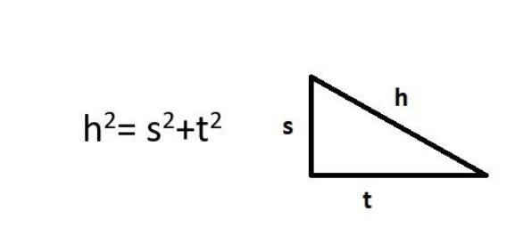
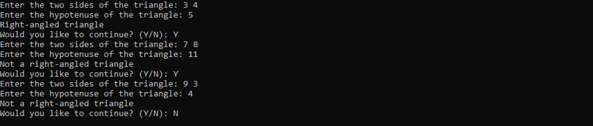
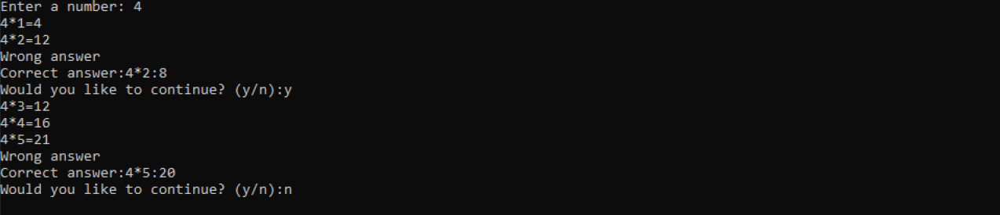
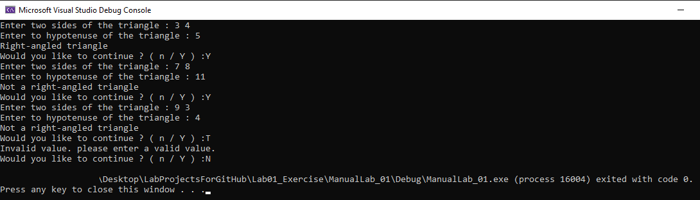
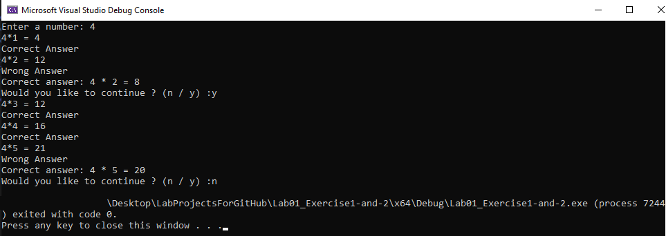

# Lab Exercise 1: An Introduction to C++

## Q1. We can read the sides of a triangle and find out if it is right-angled with the Pythagorean Theorem given below.

Write a program that reads the sides s, t, and h of an uncertain number of triangles and finds whether they are right angles. As seen in the sample printout, after each triangle, the user says "Do you want to continue?" you are asked. The program ends when the user enters the "N" character.

### Sample Output 1:

## Q2. You are asked to write a program for children trying to learn the multiplication table. The user is asked for the number to be multiplied and the multiplication value with numbers from 1 to 9 is asked. When the user gives a wrong answer, the correct answer is shown and the user is asked whether to continue or not. The same multiplication table continues to be prompted until the user enters the character "n / N". The number entered by the user must be greater than 0. If a number less than 0 is entered, the message "Number must be greater than zero" is given and it is possible to enter it again.

### Sample Output 2:

## My Output 1:

## My Output 2:

